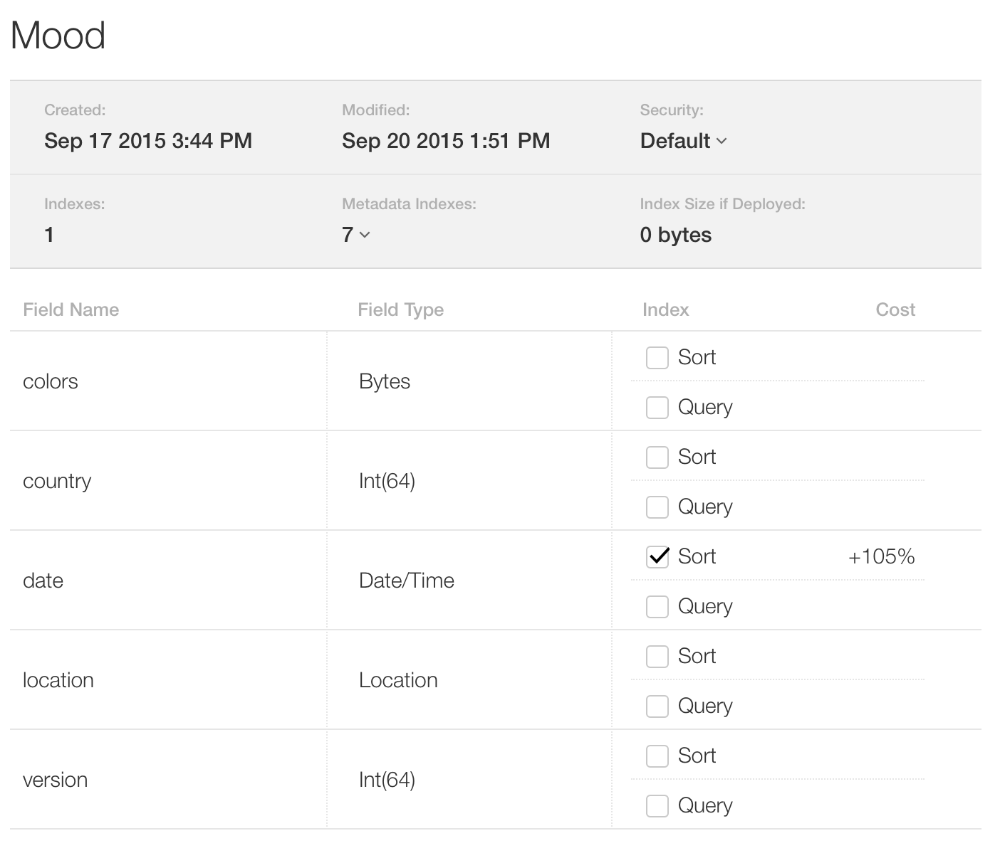

# The Moody Sample Project

This is sample code for the objc.io [Core Data book](https://www.objc.io/books/core-data/).

## Building & Running

You need [Xcode 7](https://developer.apple.com/xcode/) or later to build this project.

This project uses Cloud Kit, but by default this is turned off to make it easier to build and run the project yourself.

## Structure of the Code

The project has 6 targets:

 * The main app target
 * 3 framework targets
 * 2 test targets

The app target embeds the 3 framework targets.

The frameworks are:

 * CoreDataHelpers -- utility functions, types, protocols, etc.
 * MoodyModel -- the model classes and related logic
 * MoodySync -- the sync code that synchronizes the data with CloudKit

The app target has the UI code, i.e. view controllers etc.

## Using CloudKit

The sample app uses CloudKit, and you will not be able to connect to the public database, because it is linked to objc.io's developer account. But you can use your own.

If you want to enable CloudKit, you need the following:

 * Edit the Moody scheme and uncheck the `MoodyRemote` environment variable under *Run* -> *Arguments*.
 * You need to set up your own App ID and provisioning profile in the Member Center's [Certificates, Identifiers & Profiles section](https://developer.apple.com/account/).
 * The App ID needs to have Push Notifications and iCloud enabled. iCloud needs to include CloudKit support.
 * Change the *Bundle Identifier* of the app target in Xcode to the one of your App ID.

You'll also have to create the "Mood" record type in the CloudKit dashboard. Below is a screenshot of how this should look like:

